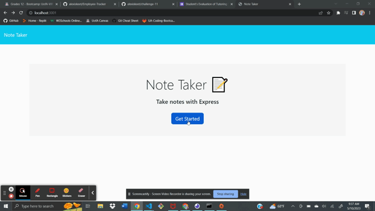

# Note Taker

Place your notes here! Type in your notes and be sure that they'll be there when you come back!

## Table of Contents
- [Installation](#installation)
- [Usage](#usage)
- [Credits](#credits)
- [License](#license)
- [Links](#links)
- [Application](#application)

## Installation
N/A

## Usage
Open the application and click the "Get Started" button on the home page. From there, you can write in your note title and note content and click the button on the upper right corner to save your note. On the left side of the screen, you can go back and look at your previously saved notes, even after leaving the site and coming back.

## Credits
N/A

## License
MIT

## Links
- [GitHub-Repo](https://github.com/alexiskeet/Note-Taker.git)
- [Live-Site](N/A)

## Application

